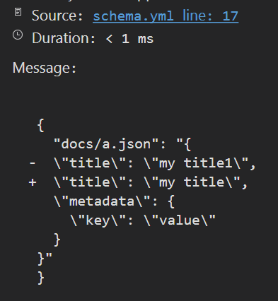

# yunit

`yunit` is a data driven testing tool for .NET using markdown and YAML.

Data driven tests separate your test data from test logic, making it easy to add, modify and review test cases.

Markdown and YAML are popular formats designed to be writable and readable by humans, using these formats makes testing more enjoyable.


## Getting Started

We have some [samples](samples) to demonstrate the usage of `yunit`, or you can follow these steps to scaffold a new test project:

1. Create a new class library

```cmd
dotnet new console
```

2. Add NuGet reference to `yunit` and `Microsoft.NET.Test.Sdk`

```cmd
dotnet add package yunit
dotnet add package Microsoft.NET.Test.Sdk
```

3. Create a serializable data contract to describe your test

```csharp
public class HelloTestSpec
{
    public string Input;
    public string Output;
}
```

4. Create a public method that takes the data contract with the corresponding verification code:

- Add `[YamlTest]` attribute to include test cases written in [YAML format](#writing-yaml-tests)
- Add `[MarkdownTest]` attribute to include test cases written in [markdown format](#writing-markdown-tests)

> 💡 The glob pattern is relative to the current working directory, which could vary based on current build configuration and target platform. Use `~/` to denote path relative to the current git repository.

```csharp
public class HelloTest
{
    [YamlTest("~/*.yml")]
    [MarkdownTest("~/README.md")]
    public void Hello(HelloTestSpec spec)
    {
        Assert.Equal(spec.Output, $"Hello {spec.Input}");
    }
}

```

5. Run your tests using `dotnet test` or Visual Studio Test Explorer. All test cases run in parallel.

## Writing YAML Tests

A YAML file can contain multiple YAML documents separated by `---`. Each YAML document is a test case.

The first line of comment appears as test description in Visual Studio test explorer.

```yml
# Hello YAML test!
input: YAML test!
output: Hello YAML test!
---
# Hello another YAML test
input: Another YAML test
output: Hello Another YAML test
```

## Writing Markdown Tests

A markdown test is a specialized YAML code block in an ordinary markdown file. A normal code block starts with 3 backticks (` ``` `). A test code block starts with _at least 6_ backticks (` `````` `). 

``````````markdown
# This is an ordinary markdown file

Using markdown tests, you can enhance your docs with real examples that are correct and up to date.

``````yml
input: Markdown Test!
output: Hello Markdown Test!
``````
``````````

You can further customize how tests are extracted from markdown files in the `[MarkdownTest]` attributes.

## Using `json-diff` for data driven assertion

You can use _any_ assertion library to verify your test expectations.

`json-diff` is a built-in tool to write assertions in YAML that fits the `yunit` testing style. 

```csharp
var jsonDiff = new JsonDiffBuilder().Build();
jsonDiff.Verify(expected, actual, "Test failed");
```

The idea of `json-dff` is to serialize your expected object and actual object into JSON and compare them using a diff algorithm.




The bare metal comparison expect the actual object to match exactly the same as the expected object, but you can custimize the `json-diff` pipeline to transform the expected and actual object before doing the text comparison. The built in `json-diff` pipeline comes with several handy extensions:


method |  description | example
-------|-----------------------------------------------|-------------
`UseIgnoreNull` | Ignore the actual result of a property if the expected value is null | `{ "a": null }` matches `{"a": xxx}` where `xxx` could be anything
`UseNegate` | Assert the actual result must not be the expected result if the expected value starts with `!` | Given an expectation of `{ "a": "!value"}` , `{"a": "value"} should fail
`UseRegex` | The value must match a regex if the expectation looks like `/{regex}/` | `{"a": "/^.*$/" }` uses `^.*$` to match the actual value
`UseWildcard` | Use wildcard match if the expectation contains `*` | `{"a": "a*" }` uses wildcard `a*` to match against actual value
`UseJson` | The value must be a JSON string and its value is verified using the current pipeline, all the above rules will apply if they are configured in the pipeline  | 
`UseHtml` | The value must be an HTML string and its value is normalized before verification |

`json-diff` allows you to write stateful data driven tests. The [Shopping Cart Web API sample](./samples) demonstrates a custom `json-diff` extension that preserves states between multiple web API calls for a typical web API testing scenario
.
